# สรุปขั้นตอนการดำเนินการโครงงาน GTXShop E-Commerce (ฉบับสมบูรณ์)

## ภาพรวมระบบ

ระบบ **GTXShop** เป็นแอปพลิเคชัน E-Commerce แบบ Full-Stack ประกอบด้วย **35 ตาราง** แบ่งตามกลุ่มการทำงานหลักดังนี้

| กลุ่ม | ตาราง |
|-------|-------|
| ผู้ใช้ & การเงิน | `user`, `wallet`, `wallet_transaction`, `store_wallet`, `store_wallet_transaction`, `store_withdrawal_request` |
| ร้านค้า & สินค้า | `store`, `store_follower`, `category`, `subcategory`, `product`, `product_variant`, `image` |
| ตะกร้า & รายการโปรด | `cart`, `product_on_cart`, `wishlist`, `recently_viewed` |
| คำสั่งซื้อ & การชำระเงิน | `order`, `product_on_order`, `coupon`, `user_coupon` |
| การจัดส่ง & ติดตาม | `shipment`, `tracking_history` |
| รีวิว & รายงาน | `review`, `review_report` |
| การคืนสินค้า | `order_return`, `order_return_item` |
| แชท & แจ้งเตือน | `chat_message`, `notification`, `notification_setting` |
| แบนเนอร์ & Flash Sale | `banner`, `flash_sale`, `flash_sale_item` |
| FAQ & Admin Log | `faq`, `admin_log` |

---

## 1. ขั้นตอนการสมัครสมาชิกและเข้าสู่ระบบ

**ตารางที่เกี่ยวข้อง:** `user`

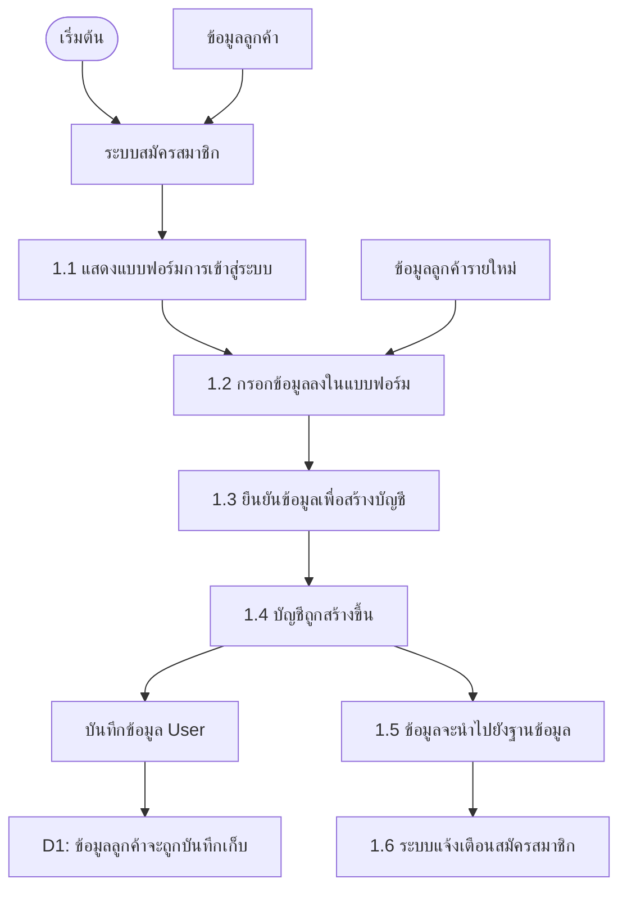

| ขั้นตอน | รายละเอียด |
|---------|-----------|
| 1.1 | แสดงฟอร์มลงทะเบียน (email, password, name) |
| 1.2 | ผู้ใช้กรอกข้อมูลส่วนตัว |
| 1.3 | ระบบตรวจสอบความถูกต้อง (email ซ้ำ, รูปแบบ) → hash password ด้วย bcrypt |
| 1.4 | สร้างบัญชีผู้ใช้ role = 'user', enabled = true |
| 1.5 | บันทึกข้อมูลลง MySQL (ตาราง `user`) |
| 1.6 | ส่ง JWT Token กลับ → ระบบแจ้งเตือนสมัครสำเร็จ |

> **รองรับ:** Login ด้วย Google (`googleId`), Facebook (`facebookId`), ยืนยันอีเมล (`verificationToken`), ลืมรหัสผ่าน (`resetPasswordToken`)

---

## 2. ขั้นตอนการจัดการกระเป๋าเงิน

**ตารางที่เกี่ยวข้อง:** `wallet`, `wallet_transaction`

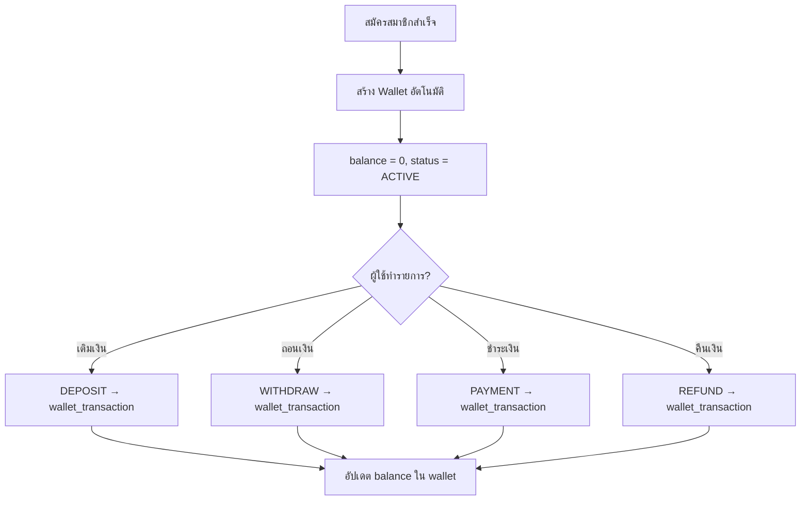

| ขั้นตอน | รายละเอียด |
|---------|-----------|
| 2.1 | สร้าง Wallet ให้ผู้ใช้อัตโนมัติ (balance = 0, status = 'ACTIVE') |
| 2.2 | ผู้ใช้เติมเงิน → บันทึก `wallet_transaction` (type = DEPOSIT) |
| 2.3 | ผู้ใช้ถอนเงิน → บันทึก `wallet_transaction` (type = WITHDRAW) |
| 2.4 | ชำระค่าสินค้า → บันทึก `wallet_transaction` (type = PAYMENT) |
| 2.5 | ได้รับเงินคืน → บันทึก `wallet_transaction` (type = REFUND) |

---

## 3. ขั้นตอนการจัดการร้านค้า

**ตารางที่เกี่ยวข้อง:** `store`, `store_follower`, `store_wallet`, `store_wallet_transaction`, `store_withdrawal_request`

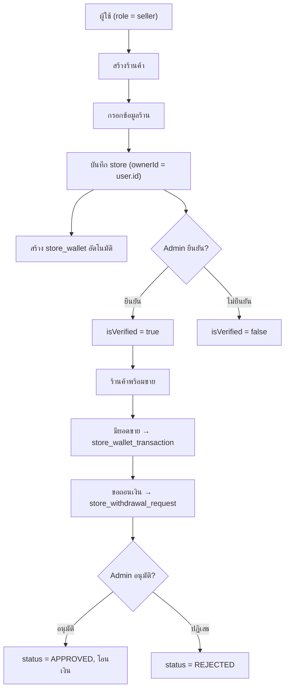

| ขั้นตอน | รายละเอียด |
|---------|-----------|
| 3.1 | ผู้ใช้ role = 'seller' สร้างร้านค้า (ชื่อ, คำอธิบาย, โลโก้) |
| 3.2 | ระบบสร้าง `store_wallet` ให้ร้านค้าอัตโนมัติ |
| 3.3 | Admin ยืนยันร้านค้า (isVerified), กำหนด isMall สำหรับร้านทางการ |
| 3.4 | ยอดขาย → บันทึก `store_wallet_transaction` (type = SALE_REVENUE) |
| 3.5 | ร้านกดถอนเงิน → สร้าง `store_withdrawal_request` (ระบุ ธนาคาร, เลขบัญชี) |
| 3.6 | Admin อนุมัติ/ปฏิเสธ → อัปเดตสถานะ, บันทึก `store_wallet_transaction` |
| 3.7 | ผู้ใช้ทั่วไปสามารถกดติดตามร้าน → บันทึก `store_follower` |

---

## 4. ขั้นตอนการจัดการหมวดหมู่สินค้า

**ตารางที่เกี่ยวข้อง:** `category`, `subcategory`

| ขั้นตอน | รายละเอียด |
|---------|-----------|
| 4.1 | Admin สร้างหมวดหมู่หลัก (เช่น เสื้อผ้า, อิเล็กทรอนิกส์) → ตาราง `category` |
| 4.2 | สร้างหมวดหมู่ย่อย ภายใต้หมวดหลัก (categoryId) → ตาราง `subcategory` |
| 4.3 | กำหนดไอคอน (emoji/image/ionicon) สำหรับหมวดย่อย |
| 4.4 | เชื่อมกับร้านค้า (storeId) สำหรับหมวดเฉพาะร้าน |

---

## 5. ขั้นตอนการจัดการสินค้า

**ตารางที่เกี่ยวข้อง:** `product`, `product_variant`, `image`, `category`, `store`

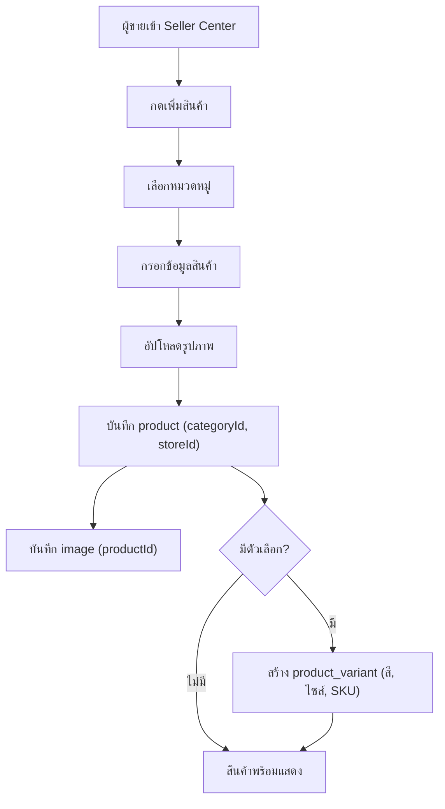

| ขั้นตอน | รายละเอียด |
|---------|-----------|
| 5.1 | ผู้ขายเลือกหมวดหมู่ และหมวดย่อย |
| 5.2 | กรอกข้อมูลสินค้า (title, price, quantity, description) |
| 5.3 | อัปโหลดรูปภาพ → Cloudinary / Local → บันทึก `image` |
| 5.4 | สร้าง Product Variant (สี, ไซส์, SKU, ราคาเฉพาะ, stock) → ตาราง `product_variant` |
| 5.5 | ตั้งส่วนลด (discountPrice, discountStartDate, discountEndDate) |
| 5.6 | สินค้าพร้อมแสดงในร้านค้า, หน้าค้นหา, และ Visual Search |

---

## 6. ขั้นตอนการดูสินค้าและรายการโปรด

**ตารางที่เกี่ยวข้อง:** `wishlist`, `recently_viewed`

| ขั้นตอน | รายละเอียด |
|---------|-----------|
| 6.1 | ผู้ใช้เลือกดูสินค้า → บันทึก `recently_viewed` (userId + productId) อัตโนมัติ |
| 6.2 | กดปุ่ม ♡ → เพิ่มเข้า `wishlist` (UNIQUE: userId + productId) |
| 6.3 | ดูรายการโปรดทั้งหมด / ลบออกจากรายการ |

---

## 7. ขั้นตอนการจัดการคูปอง

**ตารางที่เกี่ยวข้อง:** `coupon`, `user_coupon`

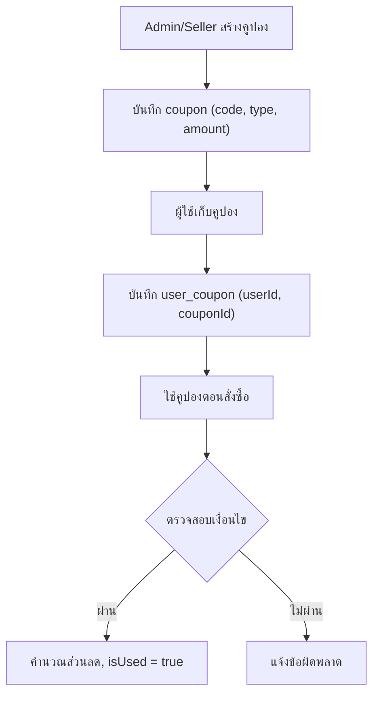

| ขั้นตอน | รายละเอียด |
|---------|-----------|
| 7.1 | Admin/Seller สร้างคูปอง (code, type, discountAmount, discountPercent, minPurchase, maxDiscount) |
| 7.2 | กำหนดเงื่อนไข: วันหมดอายุ, จำนวนทั้งหมด, จำกัดต่อผู้ใช้, กลุ่มเป้าหมาย |
| 7.3 | ผู้ใช้เก็บคูปอง → สร้าง `user_coupon` |
| 7.4 | ใช้คูปองตอนสั่งซื้อ → ตรวจสอบเงื่อนไข → คำนวณส่วนลด |
| 7.5 | อัปเดต usedCount ใน `coupon` และ isUsed ใน `user_coupon` |

---

## 8. ขั้นตอนการเพิ่มสินค้าลงตะกร้า

**ตารางที่เกี่ยวข้อง:** `cart`, `product_on_cart`

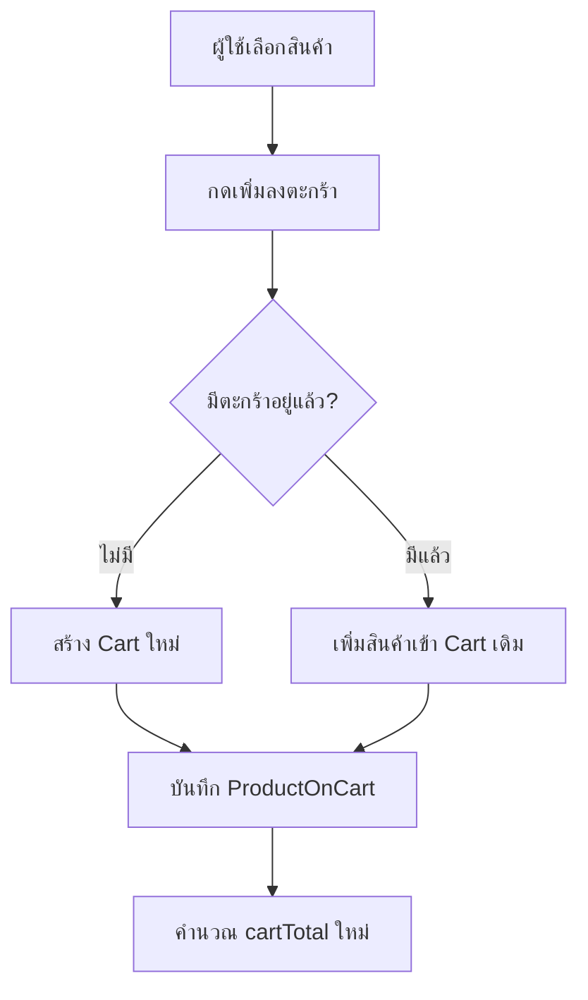

| ขั้นตอน | รายละเอียด |
|---------|-----------|
| 8.1 | ผู้ใช้เลือกสินค้า + กำหนดจำนวน + เลือก variant (ถ้ามี) |
| 8.2 | ระบบตรวจสอบว่ามี Cart อยู่แล้วหรือไม่ → สร้างใหม่ถ้ายังไม่มี |
| 8.3 | บันทึก `product_on_cart` (cartId, productId, variantId, count, price) |
| 8.4 | คำนวณ cartTotal → อัปเดตราคารวมในตาราง `cart` |
| 8.5 | ผู้ใช้สามารถเพิ่ม/ลดจำนวน หรือลบสินค้าออก |

---

## 9. ขั้นตอนการสั่งซื้อ

**ตารางที่เกี่ยวข้อง:** `order`, `product_on_order`, `cart`, `coupon`

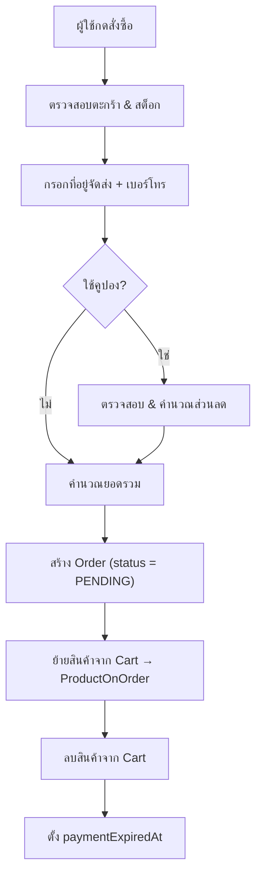

| ขั้นตอน | รายละเอียด |
|---------|-----------|
| 9.1 | ตรวจสอบสินค้าในตะกร้า & stock เพียงพอ |
| 9.2 | กรอกที่อยู่จัดส่ง (shippingAddress, shippingPhone) |
| 9.3 | ใช้คูปอง (ถ้ามี) → คำนวณ discountAmount |
| 9.4 | สร้าง `order` (status = 'PENDING', paymentMethod) |
| 9.5 | ย้ายข้อมูลจาก `product_on_cart` → `product_on_order` |
| 9.6 | ลบรายการใน `cart` & ตัดสต็อกสินค้า |
| 9.7 | ตั้งเวลาหมดอายุชำระเงิน (paymentExpiredAt) |

---

## 10. ขั้นตอนการชำระเงิน

**ตารางที่เกี่ยวข้อง:** `order`, `wallet`, `wallet_transaction`

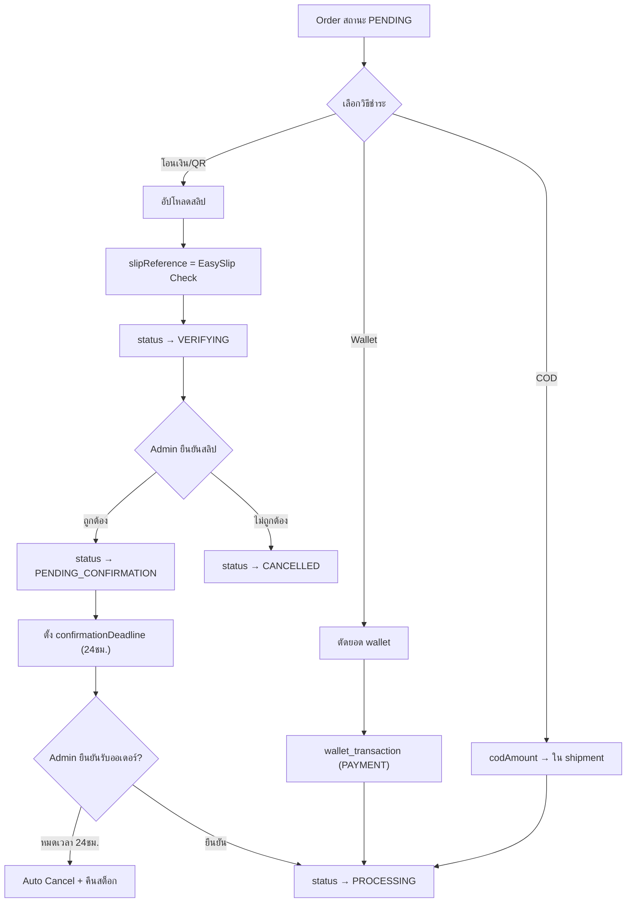

| ขั้นตอน | รายละเอียด |
|---------|-----------|
| 10.1 | เลือกวิธีชำระเงิน (Bank Transfer / COD / Wallet) |
| 10.2 | **Bank Transfer**: อัปโหลดสลิป → ตรวจสอบผ่าน EasySlip API → status = VERIFYING |
| 10.3 | **COD**: บันทึก codAmount ใน `shipment` → status = PROCESSING |
| 10.4 | **Wallet**: ตัดยอดจาก wallet → บันทึก `wallet_transaction` (PAYMENT) |
| 10.5 | Admin ยืนยันสลิป → status = PENDING_CONFIRMATION → ตั้ง confirmationDeadline (24 ชม.) |
| 10.6 | หากหมดเวลา → Cron Job ยกเลิกอัตโนมัติ + คืนสต็อก (isAutoCancelled = true) |

---

## 11. ขั้นตอน Order Status Flow

**ตารางที่เกี่ยวข้อง:** `order`

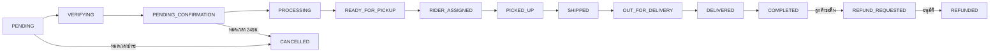

---

## 12. ขั้นตอนการจัดส่งสินค้า

**ตารางที่เกี่ยวข้อง:** `shipment`, `order`

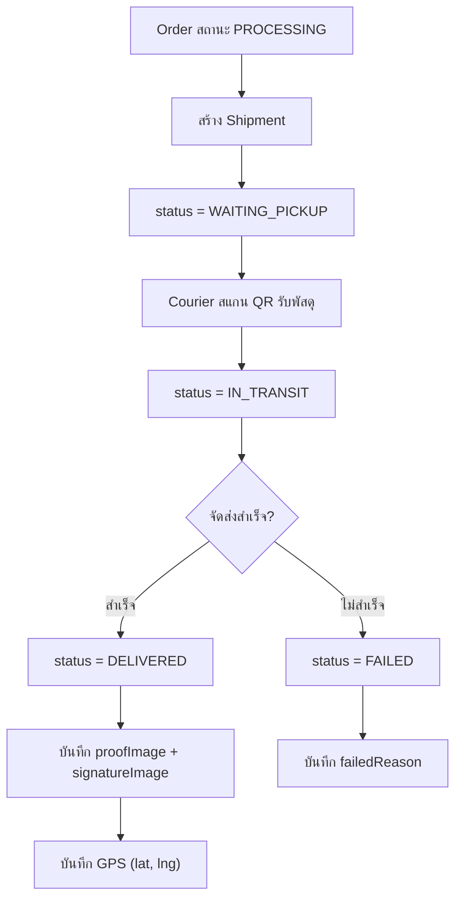

| ขั้นตอน | รายละเอียด |
|---------|-----------|
| 12.1 | ระบบสร้าง Shipment เมื่อ order = PROCESSING |
| 12.2 | กำหนด Courier (courierId) → status = WAITING_PICKUP |
| 12.3 | Courier สแกน QR Code / กรอก Order ID → รับของ → pickupTime |
| 12.4 | อัปเดตสถานะ: IN_TRANSIT → DELIVERED / FAILED |
| 12.5 | เมื่อส่งสำเร็จ: ถ่ายรูปหลักฐาน (proofImage), ลายเซ็น (signatureImage), พิกัด GPS |
| 12.6 | กรณี COD: เก็บเงิน → isCodPaid = true |

---

## 13. ขั้นตอนการติดตามพัสดุ

**ตารางที่เกี่ยวข้อง:** `tracking_history`, `order`

| ขั้นตอน | รายละเอียด |
|---------|-----------|
| 13.1 | ทุกการเปลี่ยนสถานะ → สร้างรายการใน `tracking_history` |
| 13.2 | บันทึก: orderId, status, title, description, location, createdAt |
| 13.3 | ผู้ใช้เปิดดู Timeline แบบ Real-time (เรียงตามเวลา) |
| 13.4 | ใช้ trackingNumber จากตาราง `order` เพื่อค้นหาพัสดุ |

---

## 14. ขั้นตอนการรีวิวสินค้า

**ตารางที่เกี่ยวข้อง:** `review`, `review_report`

| ขั้นตอน | รายละเอียด |
|---------|-----------|
| 14.1 | ลูกค้ารีวิวสินค้าหลังได้รับ (rating 1-5, comment, images) |
| 14.2 | ร้านค้าตอบกลับรีวิว (sellerReply) |
| 14.3 | ร้านค้ารายงานรีวิวไม่เหมาะสม → `review_report` (reason, status) |
| 14.4 | Admin ตรวจสอบ → RESOLVED (ซ่อนรีวิว isHidden = true) / REJECTED |

---

## 15. ขั้นตอนการคืนสินค้า/คืนเงิน

**ตารางที่เกี่ยวข้อง:** `order_return`, `order_return_item`, `order`

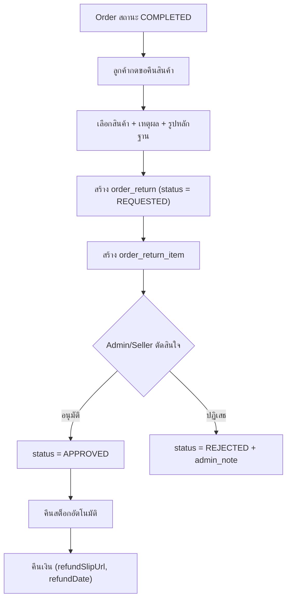

---

## 16. ขั้นตอน Flash Sale

**ตารางที่เกี่ยวข้อง:** `flash_sale`, `flash_sale_item`

| ขั้นตอน | รายละเอียด |
|---------|-----------|
| 16.1 | Admin สร้าง Flash Sale Campaign (ชื่อ, เวลาเริ่ม-สิ้นสุด) |
| 16.2 | เพิ่มสินค้าเข้าร่วม → กำหนด discountPrice, limitStock |
| 16.3 | หน้า Home แสดง Flash Sale Section + Countdown Timer |
| 16.4 | สั่งซื้อ → ระบบตรวจ quota (sold < limitStock) แบบ atomic |
| 16.5 | ใช้ discountPrice แทนราคาปกติ + อัปเดต sold |

---

## 17. ขั้นตอนระบบแชท

**ตารางที่เกี่ยวข้อง:** `chat_message`

| ขั้นตอน | รายละเอียด |
|---------|-----------|
| 17.1 | ผู้ใช้กดปุ่ม "Chat" ในหน้าสินค้า/ร้านค้า |
| 17.2 | สร้าง roomId (ใช้ userId ลูกค้า) |
| 17.3 | ส่งข้อความ (text/image) → บันทึก `chat_message` |
| 17.4 | รองรับ REST + WebSocket (Real-time) |

---

## 18. ขั้นตอนระบบแจ้งเตือน

**ตารางที่เกี่ยวข้อง:** `notification`, `notification_setting`

| ขั้นตอน | รายละเอียด |
|---------|-----------|
| 18.1 | ผู้ใช้ตั้งค่าการแจ้งเตือน (orderUpdate, promotion, chat) → `notification_setting` |
| 18.2 | ระบบส่งแจ้งเตือน (ORDER/PROMOTION/SYSTEM) → `notification` |
| 18.3 | Push Notification ผ่าน `notificationToken` ของผู้ใช้ |
| 18.4 | ผู้ใช้เปิดอ่าน → isRead = true |

---

## 19. ขั้นตอนระบบแบนเนอร์

**ตารางที่เกี่ยวข้อง:** `banner`

| ขั้นตอน | รายละเอียด |
|---------|-----------|
| 19.1 | Admin อัปโหลดรูปแบนเนอร์ (Cloudinary) |
| 19.2 | กำหนด Deep Link (เช่น gtxshop://product/1) |
| 19.3 | ตั้งลำดับแสดงผล (displayOrder) และสถานะ (isActive) |
| 19.4 | แสดงบนหน้า Home (Carousel) |

---

## 20. ขั้นตอน Admin & Audit Log

**ตารางที่เกี่ยวข้อง:** `admin_log`, `faq`

| ขั้นตอน | รายละเอียด |
|---------|-----------|
| 20.1 | ทุกการกระทำของ Admin → บันทึก `admin_log` (BAN_USER, VERIFY_STORE ฯลฯ) |
| 20.2 | `admin_log` เป็น insert-only (ไม่มี update) เพื่อเก็บ Audit Trail |
| 20.3 | Admin จัดการ FAQ (คำถาม-คำตอบ แบ่งตามหมวดหมู่) → ตาราง `faq` |

---

## ER Diagram (ความสัมพันธ์ทั้งหมด)

```mermaid
erDiagram
    USER ||--o| WALLET : "เป็นเจ้าของ"
    WALLET ||--o{ WALLET_TRANSACTION : "มีรายการ"
    USER ||--o| CART : "มีตะกร้า"
    CART ||--o{ PRODUCT_ON_CART : "มีสินค้า"
    USER ||--o{ WISHLIST : "รายการโปรด"
    USER ||--o{ RECENTLY_VIEWED : "ดูล่าสุด"
    USER ||--o{ STORE : "เป็นเจ้าของร้าน"
    USER ||--o{ STORE_FOLLOWER : "ติดตามร้าน"
    USER ||--o{ ORDER : "สั่งซื้อ"
    USER ||--o{ REVIEW : "รีวิว"
    USER ||--o{ USER_COUPON : "เก็บคูปอง"
    USER ||--o{ NOTIFICATION : "แจ้งเตือน"
    USER ||--o| NOTIFICATION_SETTING : "ตั้งค่า"
    USER ||--o{ CHAT_MESSAGE : "ส่งข้อความ"

    STORE ||--o{ PRODUCT : "ขาย"
    STORE ||--o| STORE_WALLET : "กระเป๋าเงินร้าน"
    STORE_WALLET ||--o{ STORE_WALLET_TRANSACTION : "ธุรกรรม"
    STORE ||--o{ STORE_WITHDRAWAL_REQUEST : "ขอถอนเงิน"
    STORE ||--o{ STORE_FOLLOWER : "ผู้ติดตาม"
    STORE ||--o{ SUBCATEGORY : "หมวดเฉพาะร้าน"

    CATEGORY ||--o{ SUBCATEGORY : "มีหมวดย่อย"
    CATEGORY ||--o{ PRODUCT : "จัดหมวดหมู่"
    PRODUCT ||--o{ IMAGE : "มีรูปภาพ"
    PRODUCT ||--o{ PRODUCT_VARIANT : "มีตัวเลือก"
    PRODUCT ||--o{ PRODUCT_ON_CART : "ในตะกร้า"
    PRODUCT ||--o{ PRODUCT_ON_ORDER : "ในคำสั่งซื้อ"
    PRODUCT ||--o{ WISHLIST : "ถูกเพิ่ม"
    PRODUCT ||--o{ REVIEW : "ถูกรีวิว"
    PRODUCT ||--o{ FLASH_SALE_ITEM : "ร่วม Flash Sale"

    ORDER ||--o{ PRODUCT_ON_ORDER : "มีสินค้า"
    ORDER ||--o| SHIPMENT : "จัดส่ง"
    ORDER ||--o{ TRACKING_HISTORY : "ติดตาม"
    ORDER ||--o{ ORDER_RETURN : "คืนสินค้า"
    COUPON ||--o{ ORDER : "ใช้กับ"
    COUPON ||--o{ USER_COUPON : "ถูกเก็บ"

    ORDER_RETURN ||--o{ ORDER_RETURN_ITEM : "มีรายการ"
    REVIEW ||--o{ REVIEW_REPORT : "ถูกรายงาน"
    FLASH_SALE ||--o{ FLASH_SALE_ITEM : "มีสินค้า"
```

---

## สรุป Flow หลักทั้งหมดของระบบ

```
ผู้ใช้ ──► สมัครสมาชิก (user)
          │
          ├──► สร้าง Wallet (wallet) + ทำธุรกรรม (wallet_transaction)
          │
          ├──► เปิดร้านค้า (store) ──► กระเป๋าร้าน (store_wallet)
          │    ├──► เพิ่มสินค้า (product + image + product_variant)
          │    ├──► จัดหมวดหมู่ (category + subcategory)
          │    ├──► สร้างคูปอง (coupon)
          │    ├──► ขอถอนเงิน (store_withdrawal_request)
          │    └──► ตอบแชท (chat_message)
          │
          ├──► เลือกสินค้า ──► ดูล่าสุด (recently_viewed)
          │                ──► เพิ่มรายการโปรด (wishlist)
          │                ──► เพิ่มลงตะกร้า (cart + product_on_cart)
          │                ──► เก็บคูปอง (user_coupon)
          │
          ├──► สั่งซื้อ (order + product_on_order)
          │         ├──► ใช้คูปอง (coupon)
          │         ├──► ชำระเงิน (wallet_transaction / สลิป)
          │         ├──► จัดส่ง (shipment)
          │         ├──► ติดตามพัสดุ (tracking_history)
          │         ├──► รีวิว (review)
          │         └──► คืนสินค้า (order_return + order_return_item)
          │
          ├──► ซื้อ Flash Sale (flash_sale + flash_sale_item)
          ├──► แชท (chat_message)
          ├──► ติดตามร้าน (store_follower)
          └──► ตั้งค่าแจ้งเตือน (notification_setting) ← รับแจ้งเตือน (notification)

Admin ──► จัดการผู้ใช้ / ร้านค้า / หมวดหมู่ / แบนเนอร์ (banner)
       ├──► จัดการ Flash Sale (flash_sale)
       ├──► อนุมัติถอนเงิน (store_withdrawal_request)
       ├──► ตรวจสอบรีวิว (review_report)
       ├──► บันทึกกิจกรรม (admin_log)
       └──► จัดการ FAQ (faq)
```
